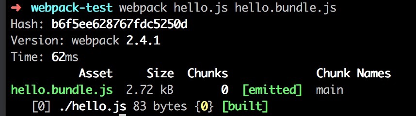
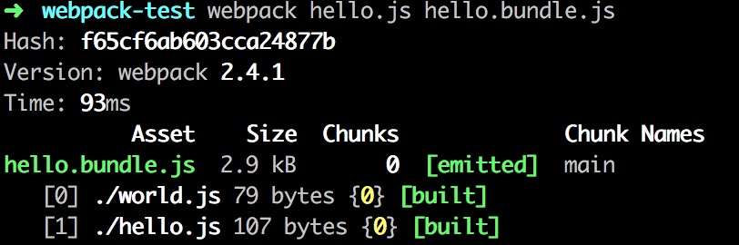
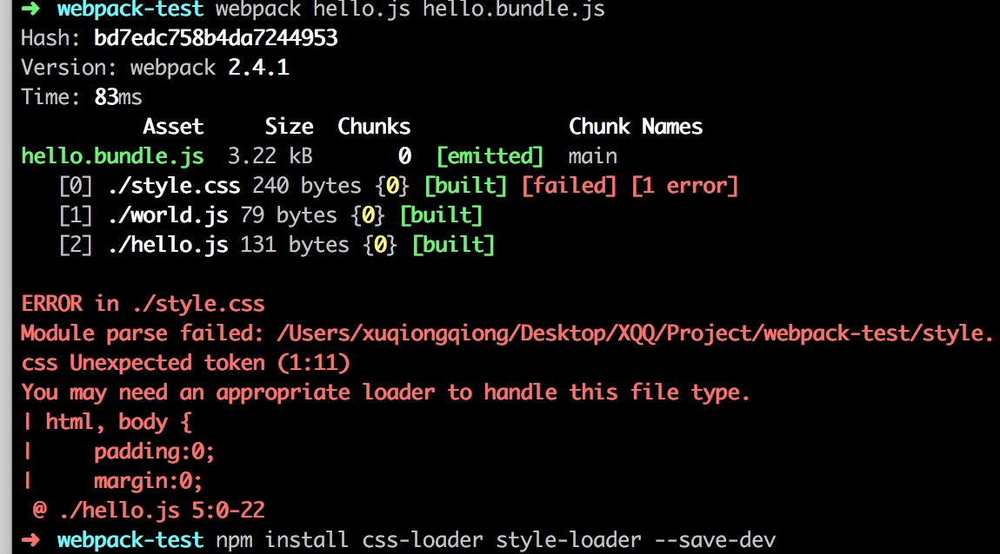

# 简单演示webpack
## 命令行安装webpack
### 初始化
切换到本地`project`文件夹下
```bash
cd project
```
新建一个文件夹`webpack-test`，以用来存放所有该项目
```bash
mkdir webpack-test
```
切换到刚刚新建的文件夹下
```bash
cd webpack-test
```
初始化生成一个`package.json`文件
```bash
npm init
```
### 安装
在上述文件夹下安装`webpack`,其中`--save-dev`表示开发时需要的依赖，会存在于`package.json`文件中`dependencies`键下，如果是`--save`表示发布后需要的依赖，会存于`package.json`文件中`devDependencies`键下。
```bash 
npm install webpack --save-dev
```
查看当前文件下的文件，会发现生成了一个`package.json`和`node_modules`。其中`package.json`是项目的基本配置包含基本的信息，项目的依赖信息等。
`node_modules`是依赖的安装目录，通过`npm`管理的依赖都安装在这个目录下。
```bash
ls
```
## 命令行中打包
使用webpack打包`hello.js`文件，设置打包后的文件名`hello.bundle.js`
```bash
webpack hello.js hello.bundle.js
```


上图中`Asset`列的内容为打包生成的文件，`size`表示打包后的文件大小，`Chunks`表示打包的分块，`chunk`打包的块名称
打包后有一个模块`hello.js`，编号为0

### 处理js文件
当`hello.js`文件中引用另一个js文件时，使用下语句进行打包
```bash
webpack hello.js hello.bundle.js
```
效果如图所示：

生成两个模块，分别编号为0,1

### 处理css文件
当`hello.js`文件中引用一个css文件时，使用下语句进行打包
```bash
webpack hello.js hello.bundle.js
```

说明webpack处理.css类型文件，需要依赖loader,安装相关loader
```bash
npm install css-loader style-loader --save-dev
```
在`hello.js`文件中的引用位置指定相应loader，表示引用`style.css`文件前，必须使用`css-loader`进行处理:
`require('css-loader!./style.css)`
为了使样式生效，需要`style-loader`,把`css-loader`处理后的文件，新建一个style标签插入到html中去:`require('style-loader!css-loader!./style.css)`
也可以使用命令行完成上述操作
```bash
webpack hello.js hello.bundle.js --module-bind 'css=style-loader!css-loader'
```

### 自动打包
添加参数`--watch`,当文件改变时，会自动打包文件
```bash
webpack hello.js hello.bundle.js --module-bind 'css=style-loader!css-loader' --watch
```
添加参数`--progress`查看打包进度，查看打包模块可以通过添加`--display-modules`，添加参数`--display-reasons`查看打包该模块的原因
```bash
webpack hello.js hello.bundle.js --module-bind 'css=style-loader!css-loader' --progress --display-modules --display-reasons
```


